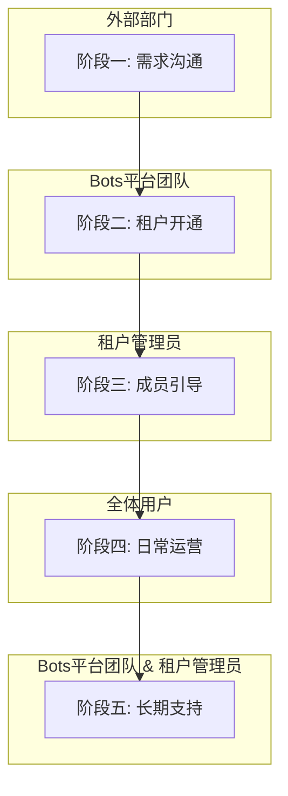

# 外部部门接入Bots平台标准作业流程 (SOP)

**版本**: V1.1
**制定日期**: 2025-05-24
**负责人**: Bots平台管理团队 (质效技术部)

---

## 1. 概述

本标准作业流程 (SOP) 旨在为希望使用Bots平台的外部部门提供一套清晰、规范的接入指引。通过遵循此流程，可以确保新租户的开通、配置和初始化过程顺畅、高效，并明确双方的责任与期望。

## 2. 流程概览图



## 3. 角色与职责

*   **外部部门负责人**:
    *   发起接入申请的决策者。
    *   指派本部门的租户管理员。
*   **租户管理员 (Tenant Admin)**:
    *   新租户的核心接口人和管理者。
    *   负责本部门内的成员邀请、组织架构搭建、权限分配和日常资源监控。
*   **Bots平台管理团队**:
    *   接收和评估接入申请。
    *   负责创建租户、分配管理员权限和激活订阅计划。
    *   提供技术支持、操作文档和管理员培训。

## 4. 接入流程 (Onboarding)

### **阶段一：需求沟通与方案确认 (预计1-3个工作日)**

1.  **发起接入申请**
    *   **执行方**: 外部部门负责人
    *   **动作**: 参考下方的**申请模板**，通过邮件或内部沟通工具向Bots平台管理团队发起正式申请。
    *   **申请模板**:
        ```
        主题：[XX部门]申请接入Bots平台

        - **申请部门**: 
        - **主要使用场景**: (简述，如：用于自动化测试流程、搭建部门内部知识问答助手等)
        - **预估用户规模**: (例如：约 50 人)
        - **部门接口人**: [姓名], [联系方式]
        - **指定租户管理员**: [姓名], [公司账号/MIS ID]
        ```

2.  **需求评估与方案推荐**
    *   **执行方**: Bots平台管理团队
    *   **动作**:
        *   与申请部门接口人沟通，确认具体需求。
        *   依据平台的订阅方案，推荐合适的**企业租户订阅计划**，并说明其权益。
        *   双方共同确认最终方案。

### **阶段二：租户开通与初始配置 (预计1个工作日)**

1.  **创建企业租户**
    *   **执行方**: Bots平台管理团队
    *   **动作**:
        *   为外部部门创建一个独立的企业租户，命名规范：`[部门名称]-Bots租户`。
        *   将指定成员账号设为**租户管理员**。
        *   *注：平台方将保留一个超级管理员账户在该租户下，仅用于后台维护和紧急支持。*

2.  **激活订阅计划**
    *   **执行方**: Bots平台管理团队
    *   **动作**: 为新租户激活双方确认的订阅计划，并周知租户管理员。

### **阶段三：成员引导与组织架构搭建 (由租户管理员主导)**

1.  **管理员赋能**
    *   **执行方**: Bots平台管理团队
    *   **动作**: 向新任租户管理员提供相关操作文档，确保其了解**"企业设置"**后台的功能。

2.  **邀请成员与搭建组织架构**
    *   **执行方**: 租户管理员
    *   **动作**:
        *   登录平台，进入**"企业设置" -> "成员与部门管理"**。
        *   使用**"邀请成员"**或**"批量导入"**功能添加部门成员。
        *   根据实际组织结构，创建子部门并分配成员。

### **阶段四：资源使用与权限管理 (日常运营)**

*   **执行方**: 租户管理员 / 空间管理员
*   **动作**:
    *   在配额内创建协作空间(Space)。
    *   在空间内为成员分配角色和权限。
    *   定期在**"企业设置" -> "租户权益"**页面监控资源使用情况。

### **阶段五：长期支持与维护**

*   **执行方**: Bots平台管理团队 & 租户管理员
*   **动作**:
    *   平台方提供技术支持渠道。
    *   当业务发展需要变更订阅时，租户管理员可联系平台方进行商议。

## 5. 租户停用流程 (Offboarding)

当部门不再需要使用Bots平台时，应遵循以下流程。

1.  **发起停用申请**
    *   **执行方**: 租户管理员
    *   **动作**: 向Bots平台管理团队发起正式的租户停用申请。

2.  **数据备份与导出 (宽限期30天)**
    *   **执行方**: 租户管理员
    *   **动作**: 在收到停用申请后，平台会提供一个为期30天的数据备份宽限期。租户管理员需要在此期间自行导出重要数据。平台方可提供必要的导出工具或协助。

3.  **租户冻结与删除**
    *   **执行方**: Bots平台管理团队
    *   **动作**: 宽限期结束后，平台将冻结该租户的所有访问权限。冻结90天后，若无特殊请求，将永久删除该租户及其所有数据。

